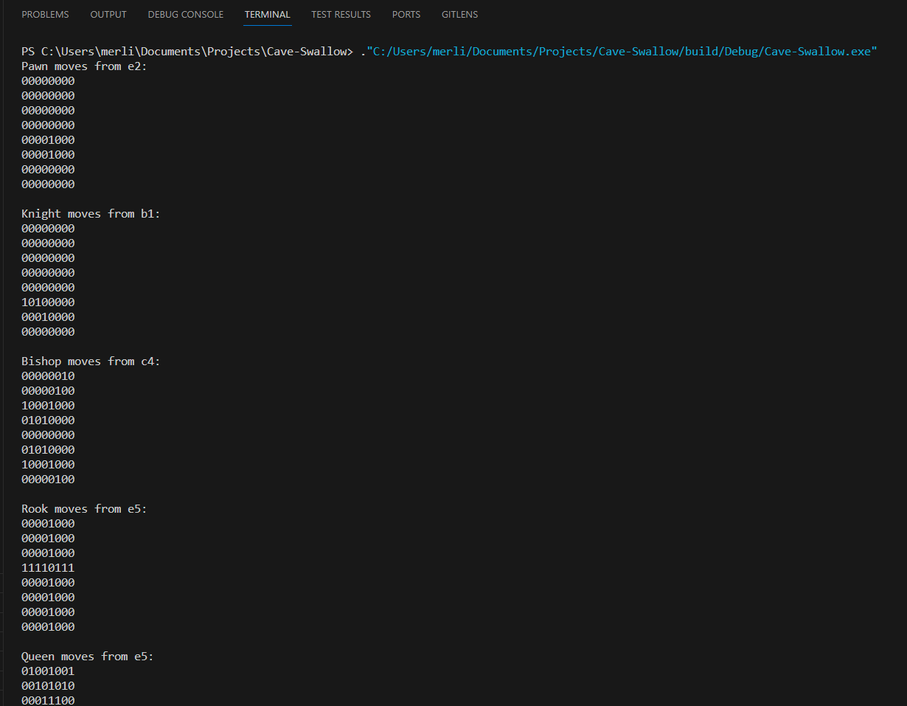
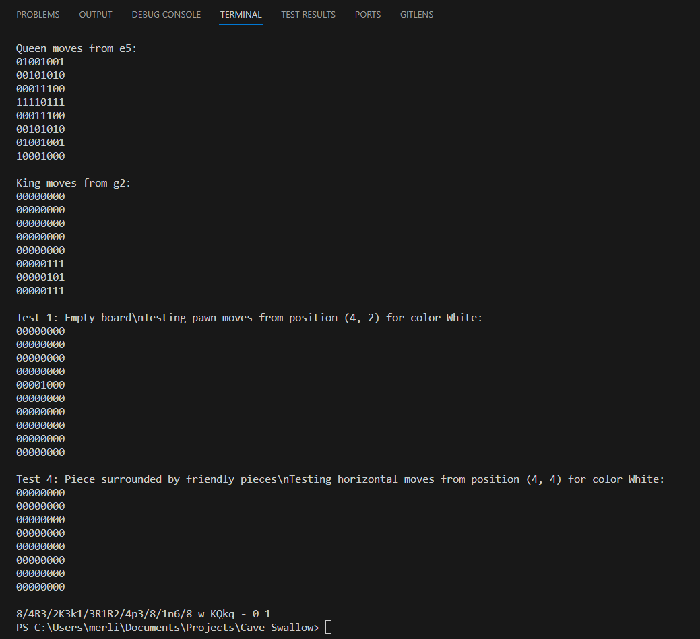

# Cave-Swallow
A basic chess engine.

## Building instructions
### Prerequisites
* CMake: If CMake is not installed, download it from the [CMake Download Page](https://cmake.org/download/).
* GNU Make and GCC/G++: These tools are generally pre-installed on Linux and macOS. For Windows, you can install them as part of [MinGW](https://www.mingw-w64.org/) or [Cygwin](https://www.cygwin.com/).

### Build the project
* After navigating to the project directory, run the following commands:
```bash
mkdir build
cd build
cmake ..
make
```
Your executable should now be in the `build` directory!


